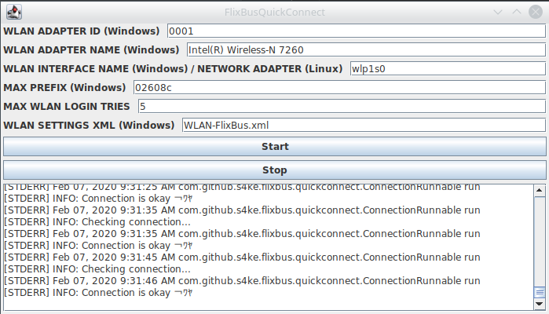

# Flixbus WLAN Tools

This repository contains tools and scripts that make it easier to surf the web when riding the bus with Flixbus, a german long distance bus company.

## ssh-proxy.sh

This is just a simple exemplary script that creates a SOCKS proxy via SSH for you. Via this SOCKS proxy you can disable any DNS sniffing/manipulation that is done by the public Flixbus hotspot. Also, any traffic going through this SOCKS proxy is encrypted and can not be read by any other users of the public WiFi.

## FlixBusQuickConnect

This GUI program automatically manages your connection to the Flixbus WiFi. It checks if you are still connected to the internet and if not, it will do everything possible to re-connect you.

Features:

- Automatically goes to the WiFi login page, and logs you in
- Checks if your connection is still live
- If your connection is not live, it automatically checks if it can connect to the internet again by changing the MAC address

# Disclaimer

Use at your own risk! All programs in this repository are intended to be a proof of concept. The author(s) can not be held accountable for any damages and additional costs that arise due to the usage of this program.
