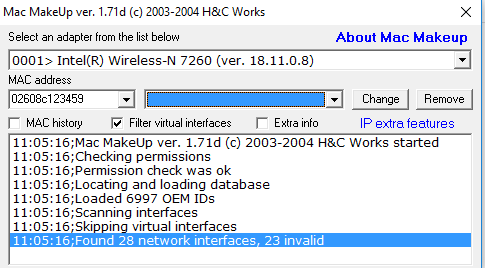
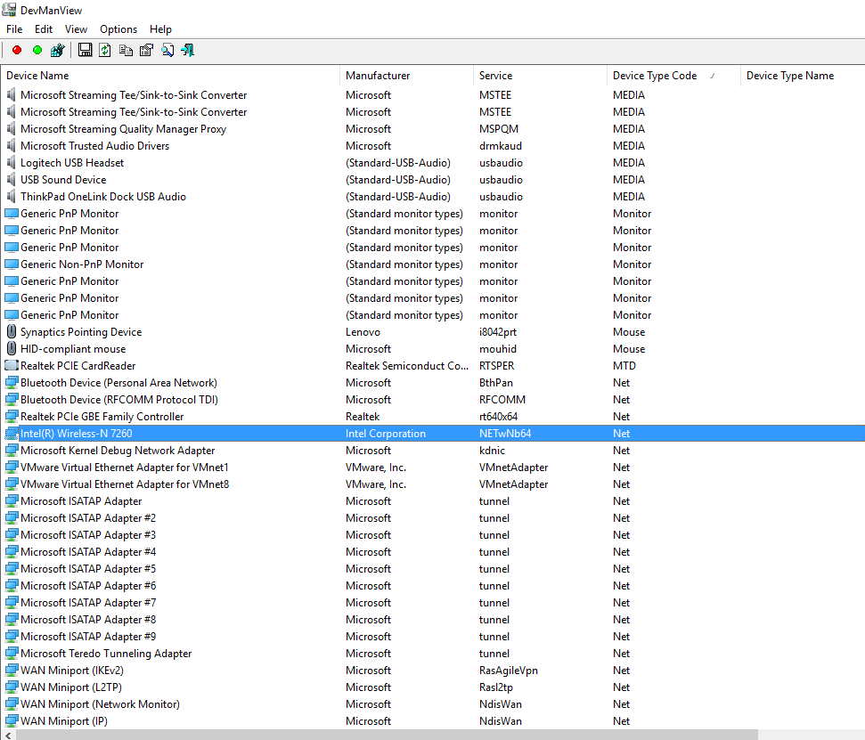
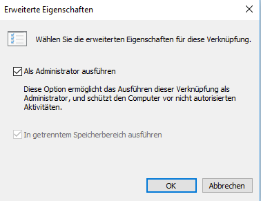

# flixbus-wlan-tools

This repository contains tools to connect to the wlan in Flixbus's fleet while still being able to surf any webpage you want. Tools for infinite WLAN usage are available as well.

Note #1: These tools are for educational usage only as the usage is against the Terms and Conditions of  the Flixbus WLAN. If you use this, you are reliable for any damage this software might have caused.

Note #2: I didn't develop the macspoofer or devmanview so these obviously don't fall under the MIT license, but I still am not responsible for any damage these might have caused, nor are the respective developers of these tools.

## REQUIREMENTS

- Admin rights
- a SSH server that can be reached from inside the Flixbus WLAN

## SETUP

1. Install Cygwin and add it to your path

2. Setup the ssh-proxy.sh file according to your needs (see documentation in the file)

3. Find out the MacMakeUp id for your network card (in this case 0001):

   

4. Replace the "0001" in the `change_mac_*.bat` and `clear_mac.bat` files. 

5. For Intel Cards (and probably others as well) only MAC addresses starting with a `02` are supported, so make sure these are set up properly in your `change_mac_*.bat` files (and that you have enough of these files for your needs)

6. Find out the device name for devmanview and change the `change_mac_*.bat` and `clear_mac.bat` files accordingly

   

7. Create Links to these files on your desktop and make sure they are automatically launched in admin mode (or you will have to right-click and choose to run it as admin):

   

8. Setup your global proxy connection or use something like Proxy Helper (for Chrome) to manage your proxy connection. (This is required to browse e.g. youtube.com)

9. Enjoy...

